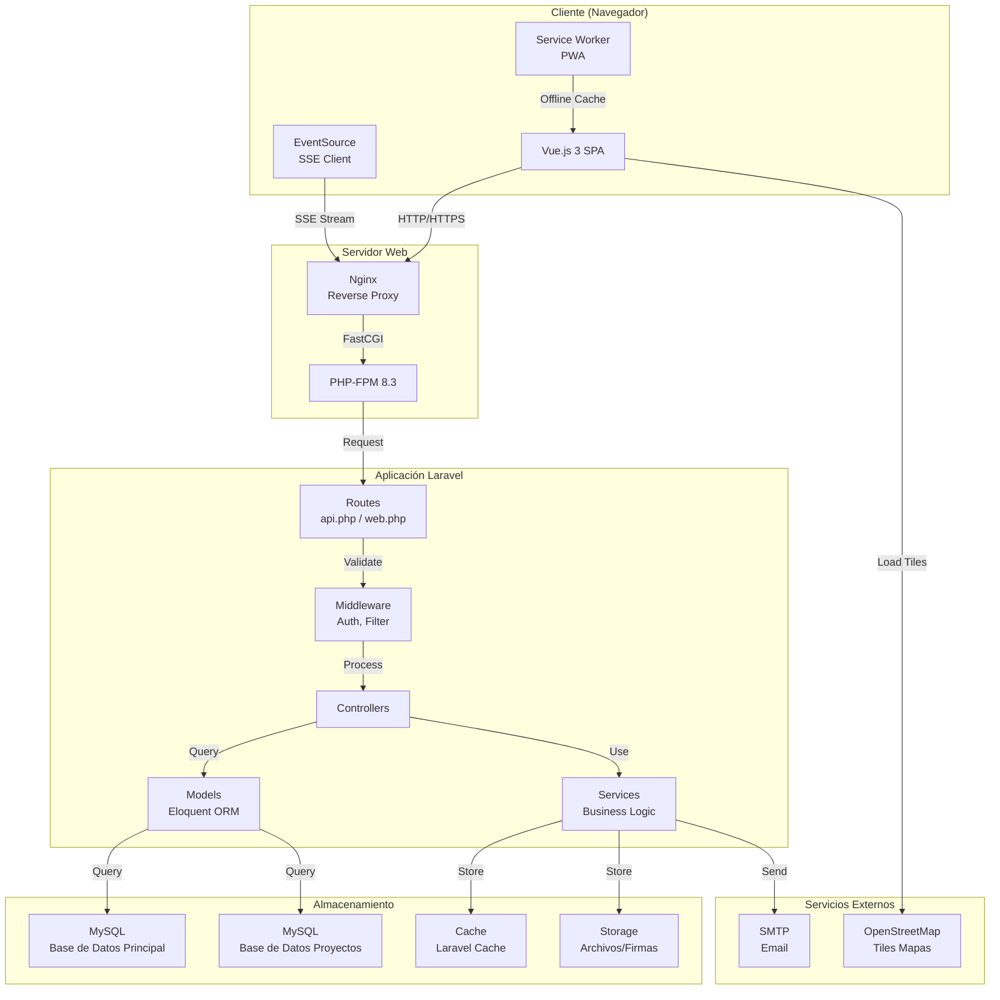
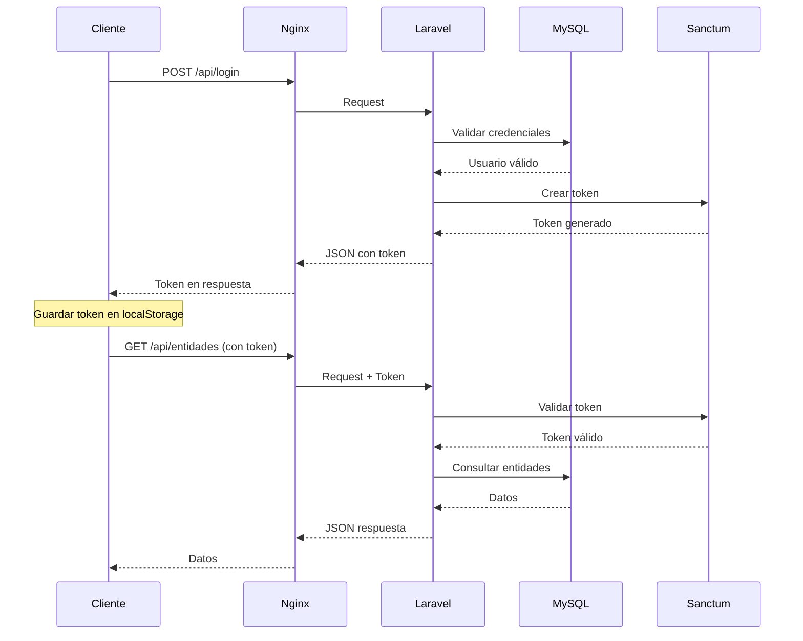
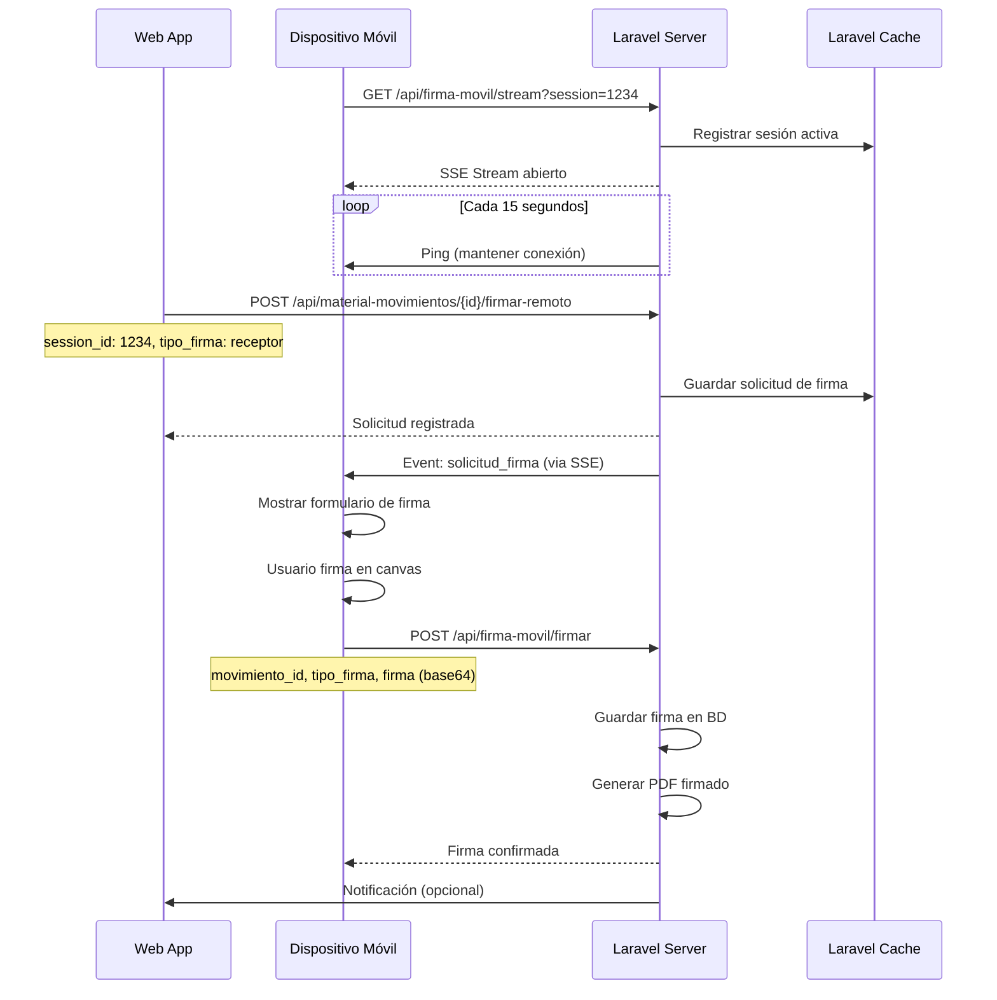

# Arquitectura del Sistema

## Visión General

El sistema de Gestión de Inventario de Material es una aplicación web full-stack que sigue una arquitectura de **Single Page Application (SPA)** con separación clara entre frontend y backend.

## Diagrama de Arquitectura



## Flujo de Autenticación



## Flujo de Firma Móvil (SSE)



## Estructura de Directorios

```
gestor-inventario-material/
├── app/                          # Lógica de aplicación Laravel
│   ├── Console/                  # Comandos Artisan
│   │   └── Commands/             # Comandos personalizados
│   ├── Http/
│   │   ├── Controllers/          # Controladores HTTP
│   │   │   ├── Api/              # Controladores API específicos
│   │   │   └── Proyectos/        # Controladores de proyectos
│   │   ├── Middleware/           # Middleware personalizado
│   │   │   ├── CheckAdmin.php    # Verificar rol admin
│   │   │   └── FilterByAlmacen.php # Filtrar por almacén
│   │   └── Kernel.php            # Registro de middleware
│   ├── Models/                   # Modelos Eloquent
│   │   └── Proyectos/            # Modelos de proyectos
│   └── Services/                 # Servicios de negocio
│       ├── NotificationService.php
│       └── PushNotificationService.php
├── bootstrap/                    # Archivos de arranque
│   └── app.php                   # Bootstrap de Laravel
├── config/                       # Archivos de configuración
│   ├── app.php                   # Configuración general
│   ├── database.php              # Configuración BD
│   ├── auth.php                  # Configuración autenticación
│   └── ...
├── database/
│   ├── migrations/               # Migraciones de BD
│   └── seeders/                  # Seeders de datos iniciales
├── public/                       # Punto de entrada público
│   ├── build/                    # Assets compilados (Vite)
│   ├── index.php                 # Entry point Laravel
│   ├── manifest.json             # Manifest PWA
│   └── service-worker.js         # Service Worker
├── resources/
│   ├── css/                      # Estilos CSS
│   ├── js/                       # Código JavaScript/Vue
│   │   ├── app.js                # Entry point Vue
│   │   ├── App.vue                # Componente raíz
│   │   ├── router.js              # Configuración Vue Router
│   │   ├── bootstrap.js           # Configuración Axios
│   │   ├── components/            # Componentes Vue reutilizables
│   │   ├── composables/           # Composables Vue
│   │   ├── layouts/               # Layouts Vue
│   │   ├── stores/                # Stores Pinia
│   │   └── views/                 # Vistas/Vistas Vue
│   └── views/                     # Vistas Blade
│       └── app.blade.php          # Template principal
├── routes/
│   ├── api.php                    # Rutas API
│   ├── web.php                    # Rutas web
│   └── console.php                # Rutas consola
└── storage/                       # Archivos de almacenamiento
    ├── app/
    │   ├── backups/               # Backups de BD
    │   ├── firmas/                # Firmas digitales
    │   └── public/                # Archivos públicos
    ├── framework/                 # Cache y sesiones
    └── logs/                      # Logs de aplicación
```

## Patrones de Diseño Utilizados

### 1. MVC (Model-View-Controller)
- **Models**: Representan entidades de negocio (`Entidad`, `MaterialMovimiento`, etc.)
- **Views**: Componentes Vue.js para la interfaz de usuario
- **Controllers**: Manejan la lógica de negocio y coordinan entre Models y Views

### 2. Repository Pattern (implícito)
- Los modelos Eloquent actúan como repositorios
- Abstracción de acceso a datos mediante ORM

### 3. Service Layer
- Servicios en `app/Services/` para lógica de negocio compleja
- Ejemplo: `NotificationService`, `PushNotificationService`

### 4. Middleware Pattern
- Filtrado de requests antes de llegar a los controladores
- Ejemplos: autenticación, autorización, filtrado por almacén

## Comunicación Frontend-Backend

### Autenticación
- **Laravel Sanctum**: Tokens de API para autenticación stateless
- Tokens almacenados en `localStorage` del navegador
- Headers: `Authorization: Bearer {token}`

### Formato de Respuestas
```json
{
  "success": true,
  "data": { ... },
  "message": "Operación exitosa"
}
```

### Manejo de Errores
```json
{
  "success": false,
  "message": "Mensaje de error",
  "errors": {
    "campo": ["Error de validación"]
  }
}
```

## Gestión de Estado (Frontend)

### Pinia Stores
- **authStore**: Estado de autenticación del usuario
- **almacenStore**: Almacenes asignados al usuario
- Otros stores según necesidad

### Composables Vue
- Reutilización de lógica entre componentes
- Ejemplo: `useAuth`, `useAlmacenes`

## Base de Datos

### Conexiones
1. **Conexión principal**: Base de datos por defecto (inventario)
2. **Conexión 'proyectos'**: Base de datos separada para proyectos

### Configuración
- Definida en `config/database.php`
- Variables de entorno en `.env`

## Seguridad

### Implementado
- Autenticación con tokens (Sanctum)
- Validación de datos en todos los endpoints
- Protección CSRF en formularios
- Escapado automático en Vue.js (XSS)
- Password hashing con bcrypt
- Rate limiting en endpoints de autenticación

### Recomendaciones
- Usar HTTPS en producción
- Configurar firewall
- Backups automáticos
- Actualizar dependencias regularmente

## Escalabilidad

### Consideraciones Actuales
- Cache de Laravel para sesiones SSE
- Índices en base de datos para consultas rápidas
- Assets compilados y optimizados

### Mejoras Futuras
- Implementar colas para tareas pesadas
- Cache de consultas frecuentes
- CDN para assets estáticos
- Load balancing si es necesario
