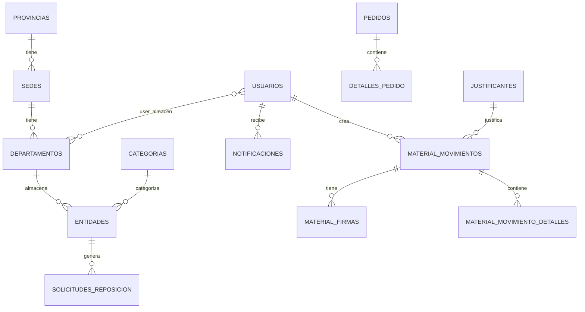

# Documentación de Base de Datos

## Diagrama Entidad-Relación



## Estructura de Base de Datos

### Base de Datos Principal

#### Tablas de Usuarios y Autenticación

##### usuarios
Almacena los usuarios del sistema.

| Campo | Tipo | Descripción | Restricciones |
|-------|------|-------------|---------------|
| id | bigint | ID único | PK, Auto increment |
| nombre | varchar(100) | Nombre del usuario | |
| apellido | varchar(100) | Apellido del usuario | |
| email | varchar(100) | Email (único) | UNIQUE, INDEX |
| password | varchar | Contraseña hasheada | |
| rol | enum | 'admin' o 'usuario' | DEFAULT 'usuario', INDEX |
| activo | boolean | Si el usuario está activo | DEFAULT true |
| ultimo_acceso | timestamp | Último acceso | NULLABLE |
| created_at | timestamp | Fecha de creación | |
| updated_at | timestamp | Fecha de actualización | |

##### sesiones
Sesiones activas de usuarios.

| Campo | Tipo | Descripción |
|-------|------|-------------|
| id | varchar(128) | ID de sesión | PK |
| usuario_id | bigint | FK a usuarios | FK, INDEX |
| ip | varchar(45) | Dirección IP | |
| fecha_expiracion | timestamp | Fecha de expiración | |
| activa | boolean | Si está activa | DEFAULT true, INDEX |
| created_at | timestamp | |
| updated_at | timestamp | |

##### intentos_login
Control de intentos de login fallidos.

| Campo | Tipo | Descripción |
|-------|------|-------------|
| id | bigint | ID único | PK |
| ip | varchar(45) | Dirección IP | INDEX |
| fecha | timestamp | Fecha del intento | INDEX |

#### Tablas Geográficas y Organizativas

##### provincias
Provincias de Andalucía.

| Campo | Tipo | Descripción |
|-------|------|-------------|
| id | bigint | ID único | PK |
| nombre | varchar | Nombre de la provincia | |
| clave | varchar | Clave única | UNIQUE |
| activo | boolean | Si está activa | DEFAULT true |
| created_at | timestamp | |
| updated_at | timestamp | |

##### sedes
Sedes/centros de la organización.

| Campo | Tipo | Descripción |
|-------|------|-------------|
| id | bigint | ID único | PK |
| nombre | varchar | Nombre de la sede | |
| clave | varchar | Clave única | UNIQUE |
| provincia_id | bigint | FK a provincias | FK |
| es_almacen_central | boolean | Si es almacén central | DEFAULT false |
| created_at | timestamp | |
| updated_at | timestamp | |

##### departamentos
Departamentos dentro de las sedes. Pueden ser almacenes.

| Campo | Tipo | Descripción |
|-------|------|-------------|
| id | bigint | ID único | PK |
| sede_id | bigint | FK a sedes | FK |
| nombre | varchar | Nombre del departamento | |
| clave | varchar | Clave única | UNIQUE |
| es_almacen | boolean | Si es un almacén | DEFAULT false |
| lat | decimal(10,8) | Latitud (para mapa) | NULLABLE |
| lng | decimal(11,8) | Longitud (para mapa) | NULLABLE |
| direccion | text | Dirección | NULLABLE |
| created_at | timestamp | |
| updated_at | timestamp | |

#### Tablas de Materiales

##### tipos_entidad
Tipos de entidades/materiales.

| Campo | Tipo | Descripción |
|-------|------|-------------|
| id | bigint | ID único | PK |
| nombre | varchar(100) | Nombre del tipo | |
| clave | varchar(50) | Clave única | UNIQUE |
| icono | varchar(50) | Icono | NULLABLE |
| color | varchar(7) | Color | NULLABLE |
| orden | integer | Orden de visualización | DEFAULT 0 |
| created_at | timestamp | |
| updated_at | timestamp | |

##### categorias
Categorías para organizar materiales.

| Campo | Tipo | Descripción |
|-------|------|-------------|
| id | bigint | ID único | PK |
| nombre | varchar | Nombre de la categoría | |
| descripcion | text | Descripción | NULLABLE |
| imagen | varchar | Ruta de imagen | NULLABLE |
| orden | integer | Orden de visualización | DEFAULT 0 |
| activo | boolean | Si está activa | DEFAULT true |
| provincia_id | bigint | FK a provincias | FK, NULLABLE |
| created_at | timestamp | |
| updated_at | timestamp | |

##### entidades
Tabla principal que almacena todos los materiales/entidades.

| Campo | Tipo | Descripción |
|-------|------|-------------|
| id | bigint | ID único | PK |
| tipo_entidad_id | bigint | FK a tipos_entidad | FK, INDEX |
| categoria_id | bigint | FK a categorias | FK, NULLABLE |
| datos | json | Datos del material | Ver estructura abajo |
| departamento_id | bigint | FK a departamentos | FK, NULLABLE |
| plano_id | bigint | FK a planos | FK, NULLABLE |
| posicion_x | decimal(5,2) | Posición X en plano | NULLABLE |
| posicion_y | decimal(5,2) | Posición Y en plano | NULLABLE |
| fotos | json | Array de rutas de fotos | NULLABLE |
| foto_visible_publico | boolean | Si la foto es visible en web pública | DEFAULT false |
| usuario_creador_id | bigint | FK a usuarios | FK, NULLABLE |
| created_at | timestamp | |
| updated_at | timestamp | |

**Estructura del campo `datos` (JSON):**
```json
{
  "nombre": "Nombre del material",
  "referencia": "REF-001",
  "descripcion": "Descripción detallada",
  "stock_minimo": 10,
  "unidad": "ud",
  "ubicacion": "Estantería A-1",
  "precio": 25.50,
  "proveedor": "Proveedor S.L.",
  "fecha_compra": "2024-01-15"
}
```

#### Tablas de Movimientos

##### material_movimientos
Movimientos de entrada y salida de material.

| Campo | Tipo | Descripción |
|-------|------|-------------|
| id | bigint | ID único | PK |
| tipo | enum | 'entrada' o 'salida' | |
| numero_documento | varchar | Número único de albarán | UNIQUE |
| fecha_movimiento | timestamp | Fecha del movimiento | |
| usuario_id | bigint | FK a usuarios | FK |
| origen | varchar | Origen del movimiento (texto libre) | |
| destino | varchar | Destino del movimiento (texto libre) | |
| origen_sede_id | bigint | FK a sedes | FK, NULLABLE |
| origen_departamento_id | bigint | FK a departamentos | FK, NULLABLE |
| destino_sede_id | bigint | FK a sedes | FK, NULLABLE |
| destino_departamento_id | bigint | FK a departamentos | FK, NULLABLE |
| justificante_id | bigint | FK a justificantes | FK |
| observaciones | text | Observaciones | NULLABLE |
| estado | enum | Estados del movimiento | Ver abajo |
| enlace_publico | varchar | Token para enlace público | NULLABLE, UNIQUE |
| enlace_expira | timestamp | Expiración del enlace | NULLABLE |
| fecha_entrega | timestamp | Fecha de entrega real | NULLABLE |
| fecha_prevista_entrega | timestamp | Fecha prevista | NULLABLE |
| entregado_por | bigint | FK a usuarios | FK, NULLABLE |
| created_at | timestamp | |
| updated_at | timestamp | |

**Estados posibles:**
- `pendiente`: Movimiento creado, pendiente de procesar
- `pendiente_firma`: Pendiente de firma
- `firmado`: Firmado completamente
- `entregado`: Entregado físicamente
- `cancelado`: Cancelado

##### material_movimiento_detalles
Detalle de cada línea de un movimiento.

| Campo | Tipo | Descripción |
|-------|------|-------------|
| id | bigint | ID único | PK |
| movimiento_id | bigint | FK a material_movimientos | FK |
| entidad_id | bigint | FK a entidades | FK |
| descripcion | varchar | Descripción del material | |
| cantidad | integer | Cantidad | |
| unidad | varchar | Unidad de medida | |
| observaciones | text | Observaciones | NULLABLE |
| created_at | timestamp | |
| updated_at | timestamp | |

##### material_firmas
Firmas digitales de los movimientos.

| Campo | Tipo | Descripción |
|-------|------|-------------|
| id | bigint | ID único | PK |
| movimiento_id | bigint | FK a material_movimientos | FK |
| tipo_firmante | enum | 'emisor' o 'receptor' | |
| nombre | varchar | Nombre del firmante | |
| apellidos | varchar | Apellidos del firmante | |
| dni | varchar | DNI | NULLABLE |
| firma_rubrica | text | Base64 de la rúbrica | NULLABLE |
| pdf_firmado | varchar | Ruta al PDF firmado | NULLABLE |
| ip_address | varchar | IP desde donde se firmó | NULLABLE |
| fecha_firma | timestamp | Fecha de la firma | |
| datos_adicionales | json | Metadata adicional | NULLABLE |
| created_at | timestamp | |
| updated_at | timestamp | |

#### Tablas de Peticiones y Pedidos

##### pedidos
Pedidos/peticiones de material.

| Campo | Tipo | Descripción |
|-------|------|-------------|
| id | bigint | ID único | PK |
| tipo | enum | 'pedido' o 'peticion' | |
| numero_pedido | varchar(50) | Número único | UNIQUE, NULLABLE |
| fecha | date | Fecha de la petición | |
| fecha_pedido | date | Fecha del pedido | NULLABLE |
| fecha_recepcion | date | Fecha de recepción | NULLABLE |
| estado | enum | Estados del pedido | Ver abajo |
| usuario_solicitante | varchar | Nombre del solicitante | NULLABLE |
| email_solicitante | varchar | Email del solicitante | NULLABLE |
| telefono_solicitante | varchar | Teléfono | NULLABLE |
| sede_id | bigint | FK a sedes | FK |
| departamento_id | bigint | FK a departamentos | FK |
| observaciones | text | Justificación/observaciones | NULLABLE |
| notas | text | Notas internas | NULLABLE |
| datos_personalizados | json | Campos personalizados | NULLABLE |
| movimiento_id | bigint | FK a material_movimientos | FK, NULLABLE |
| usuario_creador_id | bigint | FK a usuarios | FK, NULLABLE |
| token_seguimiento | varchar | Token para seguimiento público | NULLABLE, UNIQUE |
| created_at | timestamp | |
| updated_at | timestamp | |

**Estados posibles:**
- `pendiente`: Pendiente de aprobación
- `aprobado`: Aprobado
- `denegado`: Denegado
- `recibido`: Recibido
- `cancelado`: Cancelado

##### detalles_pedido
Detalle de materiales en un pedido.

| Campo | Tipo | Descripción |
|-------|------|-------------|
| id | bigint | ID único | PK |
| pedido_id | bigint | FK a pedidos | FK |
| entidad_id | bigint | FK a entidades | FK |
| cantidad | integer | Cantidad solicitada | |
| cantidad_aprobada | integer | Cantidad aprobada | NULLABLE |
| precio_unitario | decimal(10,2) | Precio | NULLABLE |
| unidad | varchar | Unidad de medida | |
| created_at | timestamp | |
| updated_at | timestamp | |

#### Tablas de Configuración

##### justificantes
Justificantes para movimientos.

| Campo | Tipo | Descripción |
|-------|------|-------------|
| id | bigint | ID único | PK |
| tipo | enum | 'entrada' o 'salida' | |
| nombre | varchar | Nombre del justificante | |
| descripcion | text | Descripción | NULLABLE |
| activo | boolean | Si está activo | DEFAULT true |
| orden | integer | Orden de visualización | DEFAULT 0 |
| created_at | timestamp | |
| updated_at | timestamp | |

##### custom_fields
Campos personalizados globales.

| Campo | Tipo | Descripción |
|-------|------|-------------|
| id | bigint | ID único | PK |
| nombre | varchar | Nombre del campo | |
| clave | varchar | Clave única | UNIQUE |
| tipo | enum | Tipo de campo | |
| opciones | json | Opciones (para select) | NULLABLE |
| obligatorio | boolean | Si es obligatorio | DEFAULT false |
| visible_publico | boolean | Si es visible en web pública | DEFAULT false |
| orden | integer | Orden de visualización | DEFAULT 0 |
| created_at | timestamp | |
| updated_at | timestamp | |

##### custom_field_values
Valores de campos personalizados.

| Campo | Tipo | Descripción |
|-------|------|-------------|
| id | bigint | ID único | PK |
| custom_field_id | bigint | FK a custom_fields | FK |
| entidad_id | bigint | FK a entidades | FK, NULLABLE |
| pedido_id | bigint | FK a pedidos | FK, NULLABLE |
| valor | text | Valor del campo | |
| created_at | timestamp | |
| updated_at | timestamp | |

##### smtp_config
Configuración SMTP para emails.

| Campo | Tipo | Descripción |
|-------|------|-------------|
| id | bigint | ID único | PK |
| nombre | varchar | Nombre de la configuración | |
| host | varchar | Servidor SMTP | |
| port | integer | Puerto | |
| username | varchar | Usuario | |
| password | varchar | Contraseña | |
| encryption | varchar | 'tls' o 'ssl' | NULLABLE |
| from_address | varchar | Email remitente | |
| from_name | varchar | Nombre remitente | |
| activo | boolean | Si está activa | DEFAULT false |
| created_at | timestamp | |
| updated_at | timestamp | |

##### notification_settings
Configuración de notificaciones.

| Campo | Tipo | Descripción |
|-------|------|-------------|
| id | bigint | ID único | PK |
| evento | varchar | Nombre del evento | UNIQUE |
| enviar_email | boolean | Si se envía email | DEFAULT false |
| enviar_push | boolean | Si se envía push | DEFAULT false |
| destinatarios | json | IDs de usuarios destinatarios | NULLABLE |
| created_at | timestamp | |
| updated_at | timestamp | |

#### Tablas de Funcionalidades Específicas

##### solicitudes_reposicion
Solicitudes de reposición de stock.

| Campo | Tipo | Descripción |
|-------|------|-------------|
| id | bigint | ID único | PK |
| entidad_id | bigint | FK a entidades | FK |
| usuario_id | bigint | FK a usuarios | FK |
| cantidad_solicitada | integer | Cantidad solicitada | |
| estado | enum | Estados | Ver abajo |
| fecha_solicitud | date | Fecha de solicitud | |
| prevision_llegada | date | Fecha prevista | NULLABLE |
| telefono | varchar | Teléfono de contacto | NULLABLE |
| observaciones | text | Observaciones | NULLABLE |
| created_at | timestamp | |
| updated_at | timestamp | |

**Estados posibles:**
- `pendiente`: Pendiente
- `en_proceso`: En proceso
- `recibida`: Recibida
- `cancelada`: Cancelada

##### user_almacen
Relación muchos a muchos entre usuarios y almacenes.

| Campo | Tipo | Descripción |
|-------|------|-------------|
| id | bigint | ID único | PK |
| usuario_id | bigint | FK a usuarios | FK |
| departamento_id | bigint | FK a departamentos | FK |
| created_at | timestamp | |
| updated_at | timestamp | |

##### push_subscriptions
Suscripciones para push notifications.

| Campo | Tipo | Descripción |
|-------|------|-------------|
| id | bigint | ID único | PK |
| usuario_id | bigint | FK a usuarios | FK |
| endpoint | text | Endpoint de suscripción | |
| keys | json | Claves de suscripción | |
| created_at | timestamp | |
| updated_at | timestamp | |

#### Tablas de Auditoría

##### registro_cambios
Auditoría de cambios en el sistema.

| Campo | Tipo | Descripción |
|-------|------|-------------|
| id | bigint | ID único | PK |
| entidad_id | bigint | ID de la entidad modificada | NULLABLE, INDEX |
| tipo_entidad | varchar(50) | Tipo de entidad | INDEX |
| accion | enum | Acción realizada | INDEX |
| datos_anteriores | json | Datos antes del cambio | NULLABLE |
| datos_nuevos | json | Datos después del cambio | NULLABLE |
| usuario_id | bigint | FK a usuarios | FK, NULLABLE, INDEX |
| ip | varchar(45) | IP desde donde se hizo | NULLABLE |
| created_at | timestamp | INDEX |
| updated_at | timestamp | |

##### material_movimientos_historial
Historial de cambios en movimientos.

| Campo | Tipo | Descripción |
|-------|------|-------------|
| id | bigint | ID único | PK |
| movimiento_id | bigint | FK a material_movimientos | FK |
| accion | varchar | Acción realizada | |
| datos_anteriores | json | Datos antes | NULLABLE |
| datos_nuevos | json | Datos después | NULLABLE |
| usuario_id | bigint | FK a usuarios | FK, NULLABLE |
| created_at | timestamp | |

##### pedidos_historial
Historial de cambios en pedidos.

| Campo | Tipo | Descripción |
|-------|------|-------------|
| id | bigint | ID único | PK |
| pedido_id | bigint | FK a pedidos | FK |
| accion | varchar | Acción realizada | |
| datos_anteriores | json | Datos antes | NULLABLE |
| datos_nuevos | json | Datos después | NULLABLE |
| usuario_id | bigint | FK a usuarios | FK, NULLABLE |
| visible_publico | boolean | Si es visible en seguimiento público | DEFAULT false |
| created_at | timestamp | |

### Base de Datos de Proyectos

Conexión separada: `proyectos`

#### proyectos
Proyectos del sistema.

| Campo | Tipo | Descripción |
|-------|------|-------------|
| id | bigint | ID único | PK |
| codigo | varchar | Código único | UNIQUE |
| nombre | varchar | Nombre del proyecto | |
| descripcion | text | Descripción | NULLABLE |
| estado | enum | Estados | Ver abajo |
| prioridad | enum | Prioridades | Ver abajo |
| fecha_inicio | date | Fecha de inicio | NULLABLE |
| fecha_fin_estimada | date | Fecha fin estimada | NULLABLE |
| fecha_fin_real | date | Fecha fin real | NULLABLE |
| progreso | decimal(5,2) | Progreso (0-100) | DEFAULT 0 |
| color | varchar(7) | Color del proyecto | DEFAULT '#006633' |
| responsable_id | bigint | FK a usuarios | FK, NULLABLE |
| creado_por | bigint | FK a usuarios | FK, NULLABLE |
| archivado | boolean | Si está archivado | DEFAULT false |
| created_at | timestamp | |
| updated_at | timestamp | |
| deleted_at | timestamp | Soft delete |

**Estados:** `planificacion`, `en_progreso`, `pausado`, `completado`, `cancelado`
**Prioridades:** `baja`, `media`, `alta`, `critica`

#### tareas
Tareas de proyectos.

| Campo | Tipo | Descripción |
|-------|------|-------------|
| id | bigint | ID único | PK |
| proyecto_id | bigint | FK a proyectos | FK |
| nombre | varchar | Nombre de la tarea | |
| descripcion | text | Descripción | NULLABLE |
| estado | enum | Estados | Ver abajo |
| prioridad | enum | Prioridades | Ver abajo |
| fecha_inicio | date | Fecha de inicio | NULLABLE |
| fecha_fin | date | Fecha de fin | NULLABLE |
| asignado_a | bigint | FK a usuarios | FK, NULLABLE |
| creado_por | bigint | FK a usuarios | FK, NULLABLE |
| created_at | timestamp | |
| updated_at | timestamp | |
| deleted_at | timestamp | Soft delete |

**Estados:** `pendiente`, `en_progreso`, `completada`, `cancelada`
**Prioridades:** `baja`, `media`, `alta`, `critica`

## Índices y Optimizaciones

### Índices Principales

- `usuarios.email`: Búsqueda rápida de usuarios
- `usuarios.rol`: Filtrado por rol
- `material_movimientos.tipo`: Filtrado por tipo
- `material_movimientos.estado`: Filtrado por estado
- `material_movimientos.enlace_publico`: Búsqueda de albaranes públicos
- `entidades.tipo_entidad_id`: Filtrado por tipo
- `entidades.categoria_id`: Filtrado por categoría
- `pedidos.estado`: Filtrado por estado
- `registro_cambios.created_at`: Consultas de auditoría

### Optimizaciones Recomendadas

1. **Particionado de tablas grandes:**
   - `registro_cambios`: Particionar por fecha
   - `material_movimientos_historial`: Particionar por fecha

2. **Índices compuestos:**
   - `(usuario_id, leido)` en `notificaciones`
   - `(tipo_entidad, entidad_id)` en `registro_cambios`

3. **Limpieza periódica:**
   - Eliminar registros antiguos de `intentos_login`
   - Archivar registros antiguos de `registro_cambios`

## Migraciones

Las migraciones se ejecutan en orden cronológico según su fecha. Ver `database/migrations/` para el listado completo.

**Orden de ejecución:**
1. `2024_01_01_000000_create_all_tables.php` - Tablas base
2. Migraciones de material (desde `_disabled/`)
3. Migraciones geográficas (provincias, sedes, departamentos)
4. Migraciones de configuración (categorías, justificantes, etc.)
5. Migraciones de funcionalidades específicas

## Seeders

### ProvinciaSeeder
Inserta las 8 provincias de Andalucía.

### DatabaseSeeder
Seeder principal que puede ejecutar otros seeders.

## Backup y Restauración

Ver `BackupController.php` para funcionalidad de backup/restore.

**Comandos:**
- Crear backup: `GET /api/config/backup/crear`
- Restaurar backup: `POST /api/config/backup/restaurar`
- Resetear sistema: `POST /api/config/backup/reset-sistema` (¡CUIDADO!)
