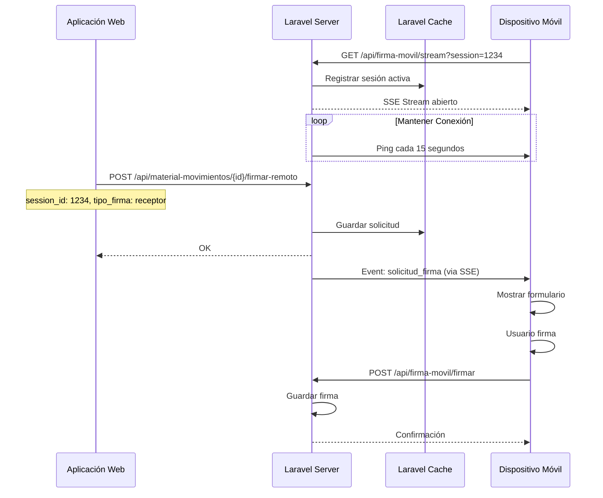

# Implementación de Server-Sent Events (SSE) para Firma Móvil

## Descripción General

El sistema implementa un mecanismo de firma móvil remota utilizando **Server-Sent Events (SSE)** para comunicación en tiempo real entre la aplicación web y dispositivos móviles. Esto permite solicitar firmas de forma instantánea sin necesidad de compartir enlaces públicos.

## Arquitectura



## Componentes

### Backend

#### 1. FirmaMovilController
**Archivo:** `app/Http/Controllers/FirmaMovilController.php`

**Método `stream()`:**
- Mantiene conexión SSE abierta
- Registra sesión en caché (expira en 24 horas)
- Envía pings cada 15 segundos
- Verifica solicitudes pendientes en caché
- Duración máxima: 1 hora

**Flujo:**
1. Recibe `session_id` como query parameter
2. Registra sesión en caché: `firma_movil_session:{sessionId}`
3. Abre stream SSE con headers apropiados
4. Envía evento `connected`
5. Loop principal:
   - Verifica solicitud pendiente: `firma_movil_solicitud:{sessionId}`
   - Si existe, envía evento `solicitud_firma`
   - Envía ping cada 15 segundos
   - Actualiza `last_ping` en caché
   - Verifica si conexión sigue activa
6. Limpia sesión al cerrar

#### 2. MaterialMovimientoController
**Archivo:** `app/Http/Controllers/MaterialMovimientoController.php`

**Método `firmarRemoto()`:**
- Recibe `session_id` y `tipo_firma`
- Valida que la sesión exista en caché
- Guarda solicitud en caché: `firma_movil_solicitud:{sessionId}`
- El stream SSE detecta y envía la solicitud

**Método `confirmarFirmaRemota()`:**
- Recibe firma desde dispositivo móvil
- Valida y guarda firma en base de datos
- Genera PDF firmado
- Limpia solicitud de caché

### Frontend

#### 1. FirmaMovil.vue
**Archivo:** `resources/js/views/FirmaMovil.vue`

**Estados:**
- `esperando`: Esperando solicitud de firma
- `firmando`: Mostrando formulario de firma
- `enviando`: Enviando firma al servidor
- `completado`: Firma completada exitosamente
- `error`: Error en el proceso

**Funcionalidades:**

1. **Generación de Session ID:**
   ```javascript
   generateSessionId() {
     return Math.floor(1000 + Math.random() * 9000).toString();
   }
   ```

2. **Conexión SSE:**
   ```javascript
   connectSSE() {
     const url = `/api/firma-movil/stream?session=${this.sessionId}`;
     this.eventSource = new EventSource(url);
     
     this.eventSource.addEventListener('message', (event) => {
       const data = JSON.parse(event.data);
       this.handleSSEMessage(data);
     });
   }
   ```

3. **Manejo de Eventos:**
   - `connected`: Confirmar conexión
   - `ping`: Mantener conexión viva
   - `solicitud_firma`: Mostrar formulario de firma

4. **Canvas de Firma:**
   - Soporte táctil (touch events)
   - Soporte mouse (desktop)
   - Conversión a base64 para envío

5. **Reconexión Automática:**
   - Si se pierde la conexión, reconecta cada 3 segundos
   - Muestra mensaje de reconexión

## Configuración de Nginx

Para que SSE funcione correctamente, Nginx debe estar configurado para no hacer buffering:

```nginx
location /gestionmaterial/api/firma-movil/stream {
    alias /var/www/gestor-inventario-material/public/;
    try_files $uri @gestionmaterial_fallback;
    
    # Configuración para SSE
    proxy_buffering off;
    proxy_cache off;
    proxy_read_timeout 3600s;
    proxy_send_timeout 3600s;
    
    # Headers SSE
    add_header Cache-Control no-cache;
    add_header X-Accel-Buffering no;
    
    # Configuración para PHP
    location ~ \.php$ {
        fastcgi_pass unix:/var/run/php/php8.3-fpm.sock;
        fastcgi_index index.php;
        fastcgi_param SCRIPT_FILENAME $request_filename;
        fastcgi_param PATH_INFO $fastcgi_path_info;
        include fastcgi_params;
    }
}
```

## Gestión de Sesiones

### Almacenamiento en Caché

Las sesiones se almacenan en caché de Laravel con las siguientes claves:

- `firma_movil_session:{sessionId}`: Datos de sesión activa
  ```php
  [
    'connected_at' => Carbon,
    'last_ping' => Carbon
  ]
  ```
  Expiración: 24 horas

- `firma_movil_solicitud:{sessionId}`: Solicitud de firma pendiente
  ```php
  [
    'movimiento' => MaterialMovimiento,
    'tipo_firma' => 'emisor' | 'receptor',
    'timestamp' => Carbon
  ]
  ```
  Se elimina después de enviarse

### Expiración

- Sesiones inactivas: 24 horas
- Conexión SSE activa: Máximo 1 hora
- Solicitudes pendientes: Se eliminan después de enviarse

## Flujo Completo de Uso

### 1. Preparación en Dispositivo Móvil

1. Usuario abre `/firmamovil` en dispositivo móvil
2. Se genera automáticamente un ID de sesión de 4 dígitos
3. Se establece conexión SSE con el servidor
4. Pantalla muestra "Esperando solicitud de firma..." con el ID de sesión

### 2. Solicitud desde Aplicación Web

1. Usuario en la web selecciona un movimiento pendiente de firma
2. Hace clic en "Firmar con móvil"
3. Introduce el ID de sesión (4 dígitos) mostrado en el móvil
4. Selecciona tipo de firma (emisor/receptor)
5. Confirma la solicitud

### 3. Recepción en Móvil

1. El stream SSE recibe el evento `solicitud_firma`
2. Se muestra el formulario de firma con datos del movimiento
3. Usuario firma en el canvas táctil
4. Usuario confirma la firma

### 4. Envío y Confirmación

1. La firma se envía al servidor como base64
2. El servidor guarda la firma en `material_firmas`
3. Se genera el PDF firmado
4. Se actualiza el estado del movimiento
5. Se muestra confirmación en el móvil
6. La aplicación web se actualiza automáticamente

## Seguridad

### Validaciones Implementadas

1. **Session ID único:** Generado aleatoriamente (4 dígitos)
2. **Expiración automática:** Sesiones expiran después de 24 horas
3. **Validación de sesión:** Se verifica que la sesión exista antes de enviar solicitud
4. **Validación de firma:** Se valida que el movimiento existe y está pendiente
5. **Límite de tiempo:** Conexión SSE máxima de 1 hora

### Recomendaciones

- Usar HTTPS en producción
- Considerar rate limiting para prevenir abuso
- Implementar logging de sesiones para auditoría
- Considerar autenticación adicional para sesiones críticas

## Troubleshooting

### Problema: El móvil no recibe solicitudes

**Causas posibles:**
1. Nginx está haciendo buffering
2. El session_id no coincide
3. La sesión expiró
4. Problemas de red/firewall

**Soluciones:**
1. Verificar configuración de Nginx (`X-Accel-Buffering: no`)
2. Verificar que el session_id sea exactamente el mismo
3. Verificar logs de caché: `php artisan cache:clear` si es necesario
4. Verificar consola del navegador para errores de EventSource

### Problema: La conexión se cierra frecuentemente

**Causas posibles:**
1. Timeout de PHP-FPM
2. Timeout de Nginx
3. Problemas de red

**Soluciones:**
1. Aumentar `proxy_read_timeout` en Nginx
2. Aumentar `max_execution_time` en PHP
3. Verificar que no haya firewalls intermedios

### Problema: Los pings no se reciben

**Causas posibles:**
1. Buffering en Nginx
2. Problemas de flush en PHP

**Soluciones:**
1. Verificar headers SSE en respuesta
2. Asegurar que `ob_flush()` y `flush()` se llamen después de cada evento

## Mejoras Futuras

1. **WebSockets:** Considerar migración a WebSockets para comunicación bidireccional
2. **Autenticación de sesiones:** Agregar autenticación adicional para sesiones
3. **Múltiples dispositivos:** Soporte para múltiples dispositivos con la misma sesión
4. **Notificaciones push:** Integrar con push notifications para alertar al móvil
5. **Historial de sesiones:** Guardar historial de sesiones para auditoría
